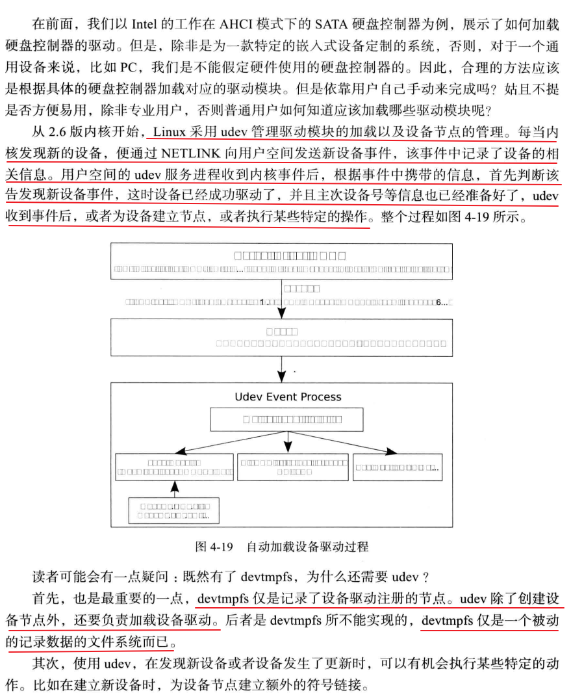
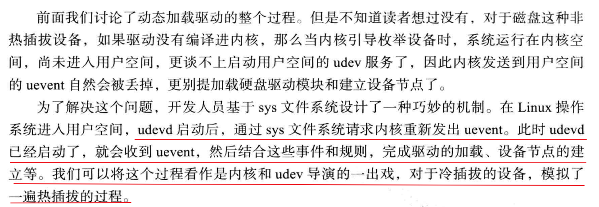
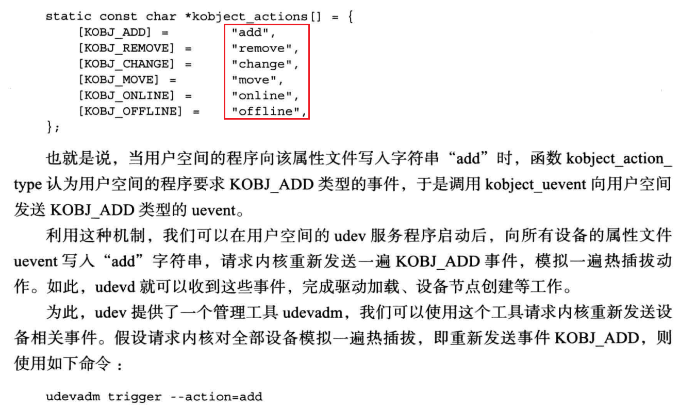

# 自动加载硬盘控制器驱动



* devtmpfs仅仅是记录了设备驱动注册的节点？这个怎么理解，如果你熟悉内核驱动的话，你应该会很清楚这个


## 内核向用户空间发送事件


* 枚举总线上的所有设备
* 构建uevent事件
* NETLINK发送uevent到用户空间


## udev加载驱动和建立设备节点

* udev是用户空间动态管理设备的机制，负责加载驱动、管理设备节点等
* udev核心服务是udevd，daemon
* udevd后台处理uevent时间，根据/etc/udev/rules.d目录下的规则进行，还有个目录/lib/udev/rules.d为系统默认配置规则
* 每当udevd收到一个内核uevent，udevd创建一个子进程处理uevent
* udevd根据uevent中的变量逐个匹配，通过根据配置规则文件名，从小到大遍历，数字越小优先级越高


## 处理冷拔查设备








## 完整实验代码

```shell
#!/bin/bash

set -xe

[ -e initramfs ] && rm -rf initramfs 
mkdir initramfs && cd initramfs

mkdir run proc sys sbin mnt root || echo 'create dir ok'
cat > init << EOF
#!/bin/bash
echo "Hello Linux!"
echo "Hello Linux!"
echo "Hello Linux!"
echo "Hello Linux!"

export PATH=/usr/sbin:/usr/bin:/sbin:/bin
mount -n -t proc proc /proc
mount -n -t sysfs sysfs /sys
mount -n -t devtmpfs udev /dev

mount -n -t ramfs ramfs /run
udevd --daemon
udevadm trigger --action=add
udevadm settle


# must before exec
exec /bin/bash
EOF

chmod a+x init

mkdir bin
cp ../sysroot/bin/bash bin/
ldd bin/bash

mkdir lib
cp -d /vita/sysroot/lib/libdl* lib/
cp /vita/sysroot/lib/libc-2.15.so lib/
cp -d /vita/sysroot/lib/libc.so.6 lib/
cp /vita/cross-tool/i686-none-linux-gnu/lib/libgcc_s.so.1 lib/
cp -d /vita/sysroot/lib/ld-* lib/

ldd lib/libdl.so.1
ldd lib/libc.so.6
ldd lib/ld-linux.so.2
ldd lib/libgcc_s.so.1


ldd /vita/sysroot/bin/mount
ldd /vita/sysroot/lib/libmount.so.1
ldd /vita/sysroot/lib/libblkid.so.1
ldd /vita/sysroot/lib/libuuid.so.1


cp /vita/sysroot/bin/mount /vita/initramfs/bin/
cp -d /vita/sysroot/lib/libmount.so.* /vita/initramfs/lib/
cp -d /vita/sysroot/lib/libblkid.so.* /vita/initramfs/lib/
cp -d /vita/sysroot/lib/libuuid.so.* /vita/initramfs/lib/

ldd /vita/sysroot/usr/bin/ls
ldd /vita/sysroot/lib/librt.so.1
ldd /vita/sysroot/lib/libpthread.so.0

cp /vita/sysroot/usr/bin/ls /vita/initramfs/bin/
cp -d /vita/sysroot/lib/librt* /vita/initramfs/lib/
cp -d /vita/sysroot/lib/libpthread* /vita/initramfs/lib


mkdir -p /vita/initramfs/lib/modules/3.7.4/kernel/drivers/ata/
cp -drf /vita/sysroot/lib/modules/3.7.4 /vita/initramfs/lib/modules/
ls -alh /vita/initramfs/lib/modules/3.7.4/kernel/drivers/ata/

ldd /vita/sysroot/usr/bin/kmod
ldd /vita/sysroot/usr/lib/libkmod.so.2

mkdir /vita/initramfs/usr/bin -p
cp /vita/sysroot/usr/bin/kmod /vita/initramfs/usr/bin/
cp -d /vita/sysroot/usr/lib/libkmod* /vita/initramfs/lib/

mkdir /vita/sysroot/sbin -p
cd /vita/sysroot/sbin
ln -fs ../usr/bin/kmod insmod
ln -fs ../usr/bin/kmod rmmod
ln -fs ../usr/bin/kmod modinfo
ln -fs ../usr/bin/kmod lsmod
ln -fs ../usr/bin/kmod modprobe
ln -fs ../usr/bin/kmod depmod

mkdir -p /vita/initramfs/sbin
cp -d insmod rmmod modinfo lsmod modprobe depmod /vita/initramfs/sbin/

ls -alh /vita/initramfs/sbin/


# 13
ldd /vita/sysroot/sbin/udevd
ldd /vita/sysroot/sbin/udevadm

mkdir /vita/initramfs/bin -p
cp /vita/sysroot/sbin/udevd /vita/initramfs/bin/
cp /vita/sysroot/sbin/udevadm /vita/initramfs/bin/
mkdir -p /vita/initramfs/lib/udev/rules.d
cp /vita/sysroot/lib/udev/rules.d/80-drivers.rules /vita/initramfs/lib/udev/rules.d/
ls -alh /vita/initramfs/lib/udev/rules.d/

ldd /vita/sysroot/usr/sbin/lspci
ldd /vita/sysroot/usr/lib/libpci.so.3
ldd /vita/sysroot/lib/libresolv.so.2

cp /vita/sysroot/usr/sbin/lspci /vita/initramfs/bin/
cp -d /vita/sysroot/usr/lib/libpci* /vita/initramfs/lib/
cp -d /vita/sysroot/lib/libresolv* /vita/initramfs/lib/

mkdir -p /vita/initramfs/usr/share
cp /vita/sysroot/usr/share/pci.ids /vita/initramfs/usr/share

ldd /vita/sysroot/usr/bin/cat
cp /vita/sysroot/usr/bin/cat /vita/initramfs/bin/

# pack
cd /vita/initramfs
find . | cpio -o -H newc |gzip -9 > /vita/13.initrd.img
cp /vita/13.initrd.img /vita/boot/13.initrd.img

cp /vita/build/linux-3.7.4/arch/x86/boot/bzImage /vita/boot/13.bzImage

```

配置启动项

```
menuentry 'vita-13'  {
        set root='(hd0,2)'
        linux   /boot/13.bzImage root=/dev/sdb1 rw
	initrd /boot/13.initrd.img
}
```


